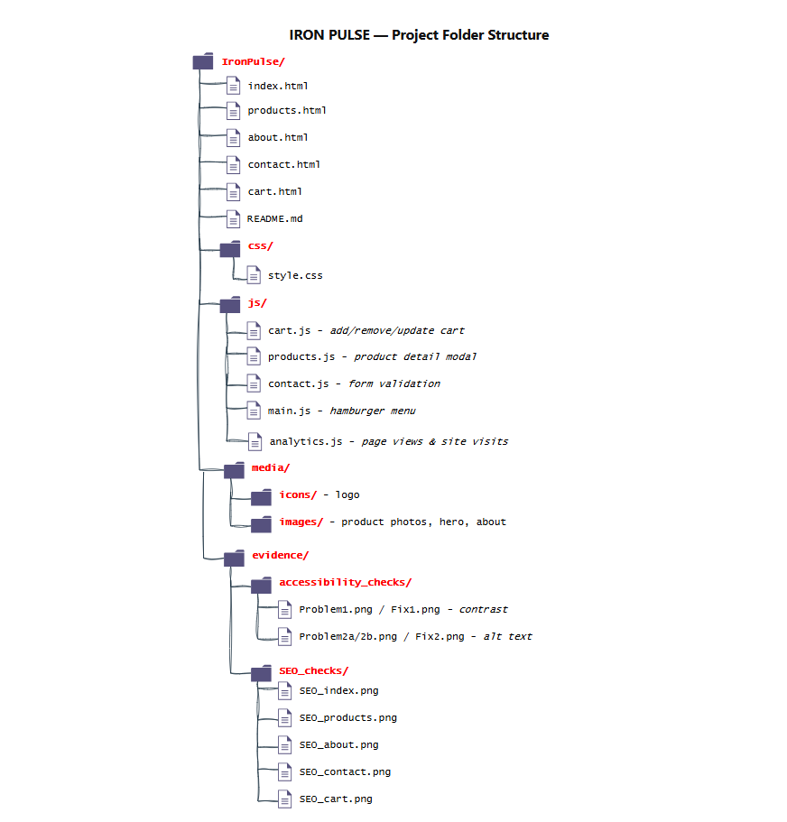

# Iron Pulse – E-Commerce Website

Iron Pulse is a front-end e-commerce website created for the CPU4104 Web Development summative assignment. It is a fictional online store selling gym and strength training equipment.

The website was built using HTML, CSS, and JavaScript.

---

## How to Run the Website

No installation is required.

1. Download or clone the project folder.
2. Open `index.html` in a web browser (Google Chrome recommended).
3. Use the navigation menu to browse the website.

The website can also be hosted using GitHub Pages.

---

## Project Structure

The image below shows the folder structure of the Iron Pulse project.

---

## Features

- Home page with a branded hero section and featured products.
- Products page displaying 12 gym equipment products.
- Product details shown when clicking on a product image.
- Shopping cart allowing users to add, remove, and update quantities.
- Cart information saved using `localStorage`.
- About page explaining the Iron Pulse brand.
- Contact page with JavaScript form validation.
- Responsive design for desktop, tablet, and mobile devices.
- Hamburger menu for smaller screens.
- Hover effects on buttons, links, and product cards.
- Simple page visit counter using `localStorage`.

---

## Technologies Used

- HTML5
- CSS3
- JavaScript
- Flexbox
- CSS Grid
- Media Queries
- localStorage

No frameworks or external libraries were used.

---

## Accessibility

The website was tested using Google Chrome Lighthouse.

Two accessibility issues were identified and fixed:

1. Improved colour contrast for product category text to make it easier to read.
2. Added missing `alt` attributes to images displayed in the shopping cart.

Evidence of these fixes can be found in:

`evidence/Accessibility_checks/`

---

## SEO

All website pages achieved a Lighthouse SEO score of 100.

SEO improvements included:

- Unique page titles.
- Meta descriptions.
- Open Graph tags for better sharing previews.

Screenshots of the SEO checks can be found in:

`evidence/SEO_checks/`

---

## Author

Kamran Ahmed Mirza 
CPU4104 Web Development – Level 4